[]{#mozTocId948437 .mozTocH1}[DVDA-Author Qt GUI how to]{style="color: Red;"}
=============================================================================

 

The new Qt5 graphical user interface aims at facilitating disc
authoring.\
This webpage documents version 19.08r2 of the GUI built with Qt5.15.0.\

 

1.  [Full view](#mozTocId92143)
2.  [Directory view](#mozTocId737554)
3.  [Authoring a disc: standard import operations](#mozTocId947499)
4.  [Extracting audio from a disc](#mozTocId394497)
5.  [Standard output operations](#mozTocId289722)
6.  [Managing files](#mozTocId366871)
7.  [Menu and Toolbar](#mozTocId829310)
8.  [The project manager](#mozTocId521077)
9.  [Burning a disc](#mozTocId324026)
10. [Log messages](#mozTocId700860)
11. [Options](#mozTocId422189)
12. [GUI options](#mozTocId965799)
13. [Progress bars](#mozTocId105820)

\

[]{#mozTocId93420 .mozTocH2}[]{style="color:
        Red;"}
--------------------------------------------

### []{#mozTocId92143 .mozTocH3}[Full view]{style="color:
        Red;"}

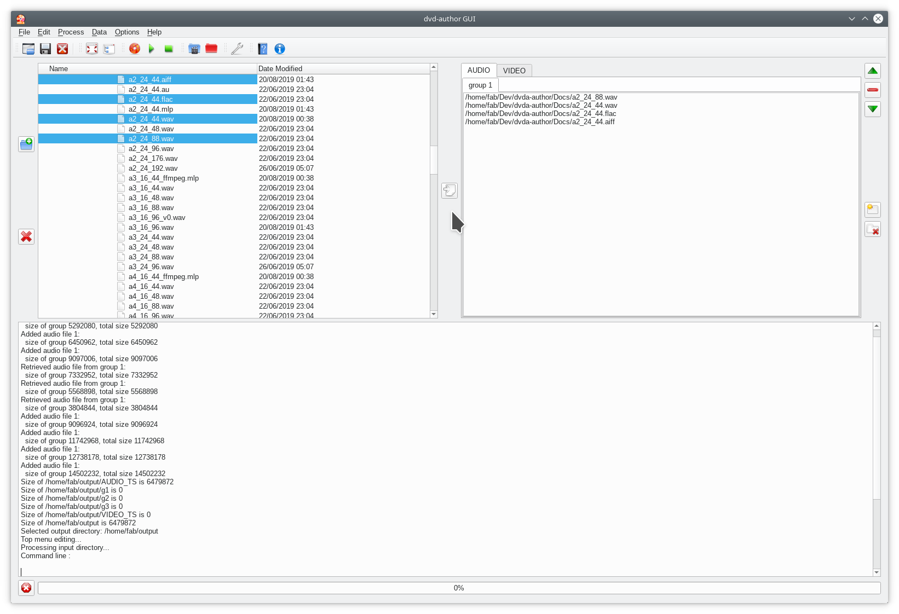

Just before burning a DVD, the full view of the interface consists of four zones:

-   a directory view (top left), which is used to select files to be
    imported
-   a central tab, with an AUDIO tab for DVD-Audio and a VIDEO tab for
    DVD-Video.
-   a log window (lower half)
-   a project manager (leftmost panel).\
    This panel can only be opened after launching a pre-recorded .dvp
    project file. This can be done by selecting the menu option *File \>
    Open project* or the first icon {width="22" height="22"} .

 

### []{#mozTocId737554 .mozTocH3}[Directory view]{style="color: #ff0000;"}
  
   
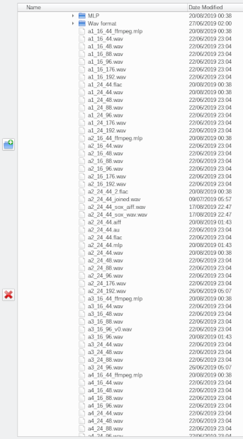

The directory view filters out all files with extensions that would not
be recognized as adequate audio input.

Multiple files can be selected by using the Ctrl and Shift keys.

Audio files in the directory viewer can be played by clicking on the
\"Play\" icon {width="22"
height="22"} or the keyboard combination Alt+P followed by striking P
alone.

Several audio files can be selected for playing. They will be played in
the top-down order of the directory view.

Playback is stopped by clicking on the \"Stop\" icon {width="22" height="22"} or the
keyboard combination Alt+P followed by striking S alone.

DVD-Audio discs (mounted or not) and AOB files can also be played.
MLP-encoded discs are supported.
   
    
     
*Limitations*   
    
Ordinary PCM (non-MLP) discs can only be played as long as the audio
characteristics (bit rate, sample rate and number of channels) of the
first track are the same in the following tracks.

Discs and AOB files can only be played from start.

To play group X of a disc, select the ATS\_0X\_1.AOB file under the
AUDIO\_TS directory.\

If the group is large, and this file reaches the 1GB limit of DVD-Audio
specifications, playback will stop at the end of this group, possibly in
the middle of a track.

To avoid this, it may be preferable to play the disc (or the filesystem
in the directory view) at the root. The root is just above the AUDIO\_TS
directory.\

All .AOB files under this root will be played back continuously until
the \"Stop\" icon {width="22"
height="22"} is clicked.

 

### []{#mozTocId947499 .mozTocH3}Authoring a disc: standard import operations

*1. Choosing the zone*

Files can be imported to either or both **zones** of the DVD: the Audio
zone, which creates a DVD-Audio disc, the Video zone, which creates a
DVD-Video disc

with mainly audio content and possibly both of them for a *hybrid*
DVD-Audio/Video or *universal* disc.

Just select the appropriate AUDIO or VIDEO tab in the main tab before
importing files.

*2. Selecting files*

The directory view can be used to select directories or files. You can
add most common audio formats, including wav, aiff, flac, ogg and mlp.

On selecting a directory, all supported audio files will be added
recursively to the input tabs later on.

*3. Importing files*

Then press the \"Right arrow\" or \"Import\" button
{width="22" height="22"}  to add
the selection to the central tab.

In the tree view select any number of files (you may have to press on
Ctrl and/or Shift as is usual).

You may import as many as 99 files per group from the tree view by
clicking on the import file icon {width="22" height="22"} (even more if
your files have same audio characteristics).

*4. Drag-and-dropping files*

Alternatively to importing files from the tree view, you may also opt
for dragging and dropping files from your favorite file system explorer.

Just click on the tab of the destination group and drop files into the
application.

*5. Option Video import*

Optionally, you can add a video input directory, which must contain all
VIDEO\_TS files (with extensions IFO, BUP and VOB).

Then press the Video button {width="22"
height="22"} in the toolbar.

 

### []{#mozTocId394497 .mozTocH3}Extracting audio from a disc

If you do not want to create a DVD-Audio disc but instead extract audio
from an existing DVD-Audio structure, first select the AUDIO tab in the
main import tab,

then the DVD-Audio directory or disc containing the audio to be
extracted in the directory view on the left, then click on the
\"Inport\" button {width="22"
height="22"} 

Check the resulting tab then click on the
{width="22" height="22"} \"Burn\" icon. When
AOB files are imported, this icon triggers audio extraction, not disc
burning.

 

 

### []{#mozTocId289722 .mozTocH3}Standard output operations

You can also select existing directories as output directories. If the
directory is not empty, a dialog window will warn you that it will be

erased then recreated. Then press the Output {width="22" height="22"} toolbar button.

Should you omit this step, the GUI will output a DVD-Audio file
structure in a directory named **output** adjacent to the GUI
executable.

To avoid overwriting an existing directory, you may choose to erase it
manually (with all its subfolders and files) by pressing the cross icon
{width="22" height="22"}.

It may also be useful to create an empty new directory with the add
directory icon {width="22"
height="22"}

In this case, an input dialog will pop up requesting a directory name.

 

### []{#mozTocId366871 .mozTocH3}[Managing files]{style="color: Red;"}

 

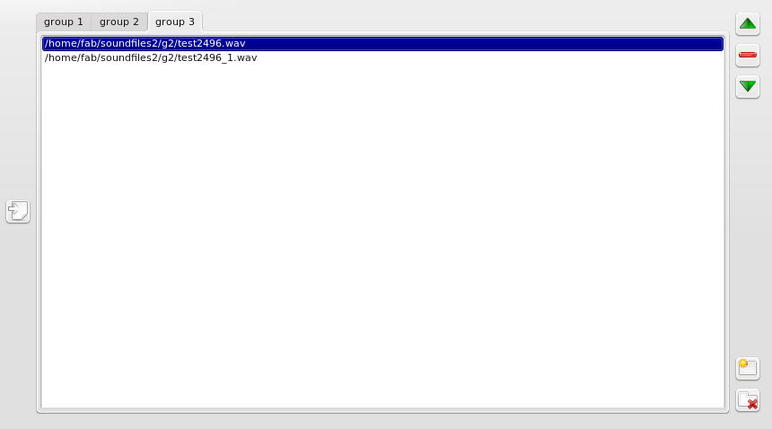

 

Click on the tab corresponding to the group that you would like to
create.

The read minus icon {width="22"
height="22"} on the right may be used to withdraw a selected file from
the audio list.

Use the up {width="22" height="22"} and
down {width="22" height="22"} arrows
to move a selected file within the same audio group so that it is played
sooner (up arrow) or later (down arrow):

 

 

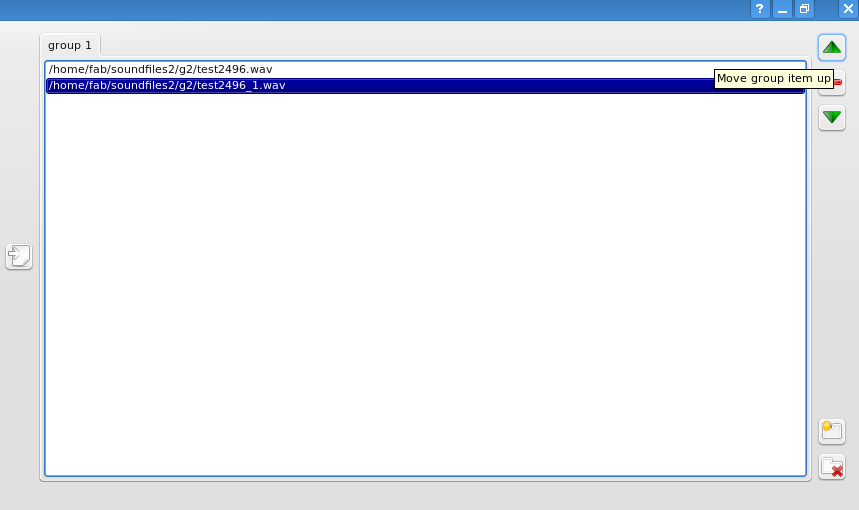

 

 

Create as many groups as are necessary (with a maximum of 9) by clicking
on the Add group icon {width="22" height="22"}

You may delete a selected group by clicking on the Delete group button
{width="22" height="22"}

 

### []{#mozTocId829310 .mozTocH3}[Menu and Toolbar]{style="color: Red;"}

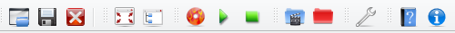

 

The toolbar contains the following buttons:\

file buttons

-   Open project  {width="22" height="22"}
-   Save project  {width="22" height="22"}
-   Exit button  {width="22" height="22"}

edit/show buttons

-   Full screen/Normal screen  {width="22" height="22"}
-   Display/Close project manager  {width="22" height="22"}

process buttons

-   Burn {width="22" height="22"}
-   Play {width="22" height="22"}
-   Stop {width="22" height="22"}

data buttons:

-   Video {width="22" height="22"}
-   Output {width="22" height="22"}

and standard interface buttons:

-   Options {width="22" height="22"}
-   Help {width="22" height="22"}

 

A Menu displays the same commands/options as the toolbar buttons:

 

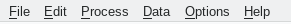

 

You can use keyboard shortcuts (e.g. under Windows, Alt+F followed by S
to save a project).

 

### []{#mozTocId521077 .mozTocH3}The project manager

On opening a project file (with .dvp extension), the interface shows the
parameters of the project on the left of the file explorer.

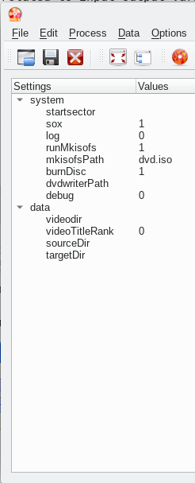

System settings are all session-specific variables, which are collected
by the Options dialog (see below).

Data settings are related to input-output variables (like audio files or
target output directory).You can expand or collapse the data by pressing
on the +/- sign.

To display a project manager, you should first load it by pressing on
the Open project button {width="22" height="22"}.

The project manager window will automatically open and all files
initially listed in the project maker tab widget (top right) will be
displayed.

Should you like to save both session-specific system settings and
input/ouput data, create a .dvp project file by pressing on the Save
project button {width="22" height="22"}.

An XML file will be created with all necessary information.

### []{#mozTocId324026 .mozTocH3}[ Burning a disc]{style="color: red;"}

To burn a disc, use the Burn button {width="22" height="22"} on the left
of the command zone.

You need to have an ISO image of the disc before burning your DVD-Audio.

This is managed by the Options dialog (see below).

 

To create a DVD-Audio disc press on the Burn icon.

You can deselect ISO file creation and burning in the options dialog to
just create the file structure under the default output repertory (in
you home directory), or under the selected Output directory.

### []{#mozTocId700860 .mozTocH3}[Log messages]{style="color: Red;"}

The lower part of the interface is a log window that displays
information on what is being done by the GUI or processed by
dvda-author, notably

directory sizes. Below are a few messages generated while authoring a
project with the project maker:

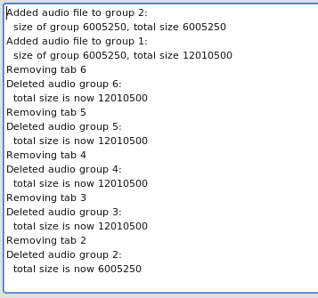

### []{#mozTocId422189 .mozTocH3}[Options]{style="color: Red;"}

An options dialog will pop up on pressing on the Options button
{width="22" height="22"} in the command zone.

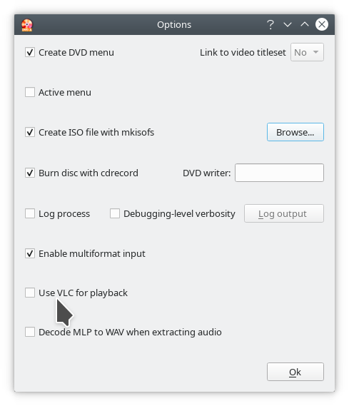

*1. Logging*

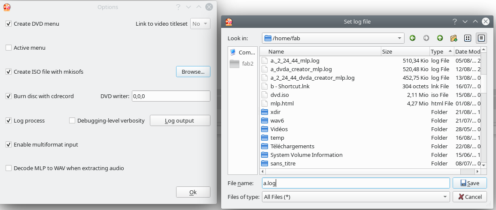

To enable log file creation, check the Log process checkbox then press
on the Log output button to select a log.

If the log file already exists, the new log will be appended to it and a
confirmation dialog will appear (KDE linux view).

The output directory can be changed by pressing on the Browse button to
select an existing filename.

Just enter a new filename in the file dialog window and save.
 

*2. Image and disc authoring*

To enable ISO file creation, the mkisofs checkbox is checked by default.

Similarly the \"Burn disc\" box is checked by default. Unchek if you
just want to create the ISO image.

If there is only one DVD writer in the platform, it is usually
automatically selected.

In some cases (several devices) it may be necessary to indicate the
right DVD burner.

By default the scanbus value for cdrecord is 0,0,0. If this does not
give correct results, manually change to 1,0,0 or 2,0,0 and so on.

 

*3. Menu authoring and videozone linking*

By default, a top menu in the DVD-Audio zone will be generated that
allows the user to navigate between tracks and groups using a remote
control.

This option can be deselected in the Options dialog.

If a menu is created, one or several track links can be created
optionally to one or several tracks in the DVD-Video zone.

This is only possible if files have been previously imported to the
VIDEO tab.

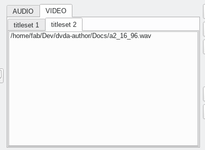

Then select the track to be linked to: click on the widget right to
\"Link to video titleset\" and change the value from **No** to the rank
of the track in the first titleset.

If a track in the second titleset is to be linked to, use the widget
coming second to the right and so on.

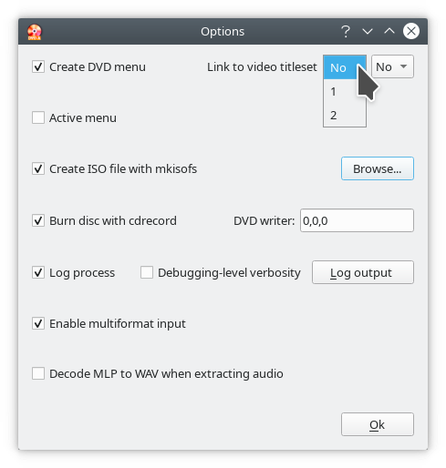

*Note: The total number of audio groups in the AUDIO tab and of video
links cannot be greater than 9.*

The \"Active menu\" checkbox may be checked to allow the top menu to
remain visible on playback. By default, it disappears after a track link
is clicked.

 

*4. Audio formats*

By default, converting usual audio formats into wav before processing
the disc is enabled.

The following formats are supported using
[SoX](http://sox.sourceforge.net/):

-   wav
-   flac
-   oga
-   aif
-   aiff
-   aiffc
-   al
-   amb
-   au
-   avr
-   cdda
-   cdr
-   cvu
-   gsm
-   gsrt
-   hcom
-   ima
-   ircam
-   la
-   lpc
-   lpc10
-   lu
-   maud
-   mlp
-   nist
-   ogg
-   s16
-   s2
-   s3
-   s32
-   s4
-   s8
-   sb
-   sf
-   sl
-   sln
-   smp
-   snd
-   sndr
-   sndt
-   sph
-   sndt
-   sw
-   txw
-   vms
-   voc
-   vorbis
-   vox
-   wavpcm
-   wv
-   wve
-   xa

 

An internal MLP ([Meridian Lossless
Packing](https://en.wikipedia.org/wiki/Meridian_Lossless_Packing))
decoder is integrated using capabilities developed by the
[ffmpeg](https://ffmpeg.org/) project.

*Warning*

Using this decoder may raise legal issues in some countries (outside of
the European Union).

Please make sure that using the **ffmpeg** MLP decoder/encoder is legal
in your country before checking the \"Decode MLP\" box to activate
automatic MLP conversion to WAV.

This decoder is optionally used when disc audio is extracted as
indicated above. When the box is checked, discs with MLP-encoded content
will be extracted both as .mlp and .wav files.

*4. Playback*   

By default, playback uses the **ffplay** binary.  
 
Optionally playback can be monitored using VLC.

*Warning*   

VLC should be installed in the standard install path (/usr/bin, /usr/local/bin 
for *nix platforms, and C:\\Program Files\\VideoLan\\VLC for Windows).     
    
     
   

    

### []{#mozTocId965799 .mozTocH3}GUI options

The Full screen button {width="22" height="22"}
maximizes the size of the application.

The icon automatically toggles to the Show normal icon {width="22" height="22"} when the window is maximized.

If you press again on the same button, the size of the window will be
changed back to normal size.

 

### []{#mozTocId105820 .mozTocH3}Progress bars

A progress bar will display the real-time percentage of expected ouput
that was already processed by dvda-author.

If an ISO image is created, another will appear to indicate progress of
ISO file creation below the first progress bar.

If you burn your disc, a third bar will appear to indicate progress of
DVD burning.

If the burning process appears frozen, reset your writer and open/close
your tray. Wait for a while then launch again by pressing on the
\"Burn\" icon.

You can kill any process by pressing on the Stop process button {width="22" height="22"} on the left of
the progress bar.

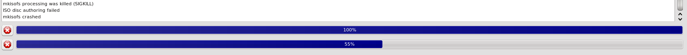

 
